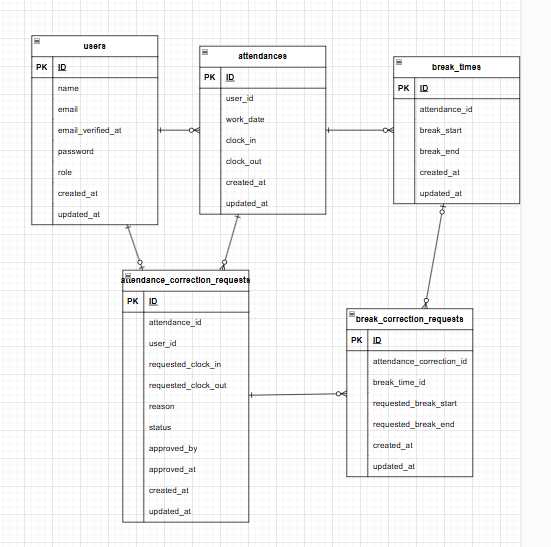

# Attendance

# 環境構築

## Docker

git clone https://github.com/Naruyama628/Attendance.git  
cd Attendance

cp src/.env.example src/.env

.envに環境変数を反映

docker-compose up -d --build

###Laravel  
docker-compose exec php bash  
composer install  
php artisan key:generate  
php artisan migrate  
php artisan db:seed

## 環境変数

MAIL_MAILER=smtp  
MAIL_HOST=sandbox.smtp.mailtrap.io  
MAIL_PORT=2525  
MAIL_USERNAME=xxxxxx  
MAIL_PASSWORD=xxxxxx  
MAIL_ENCRYPTION=null  
MAIL_FROM_ADDRESS=no-reply@example.com  
MAIL_FROM_NAME="${APP_NAME}"

DB_CONNECTION=mysql  
DB_HOST=mysql  
DB_PORT=3306  
DB_DATABASE=laravel_db  
DB_USERNAME=laravel_user  
DB_PASSWORD=laravel_pass

# テスト環境

.env.testing を作成

APP_ENV=testing  
APP_KEY=

DB_CONNECTION=mysql  
DB_HOST=mysql  
DB_PORT=3306  
DB_DATABASE=attendance_test  
DB_USERNAME=laravel_user  
DB_PASSWORD=laravel_pass

docker-compose exec php bash

php artisan key:generate --env=testing

php artisan migrate:fresh --seed --env=testing

# 使用技術

PHP 8.2.11

Laravel 8.83

MySQL 8.0.26

nginx 1.21.1

phpMyAdmin

Docker / Docker Compose

# ER図

# URL

- 一般ユーザーログイン画面
  - http://localhost/login
  - 一般ユーザー1
    - メールアドレス:user1@example.com
    - パスワード:password
  - 一般ユーザー2
    - メールアドレス:user2@example.com
    - パスワード:password

- 管理者ログイン画面
  - http://localhost/admin/login
  - 管理者ユーザー
    - メールアドレス:admin@example.com
    - パスワード:password

- phpMyAdmin
  - http://localhost:8080
